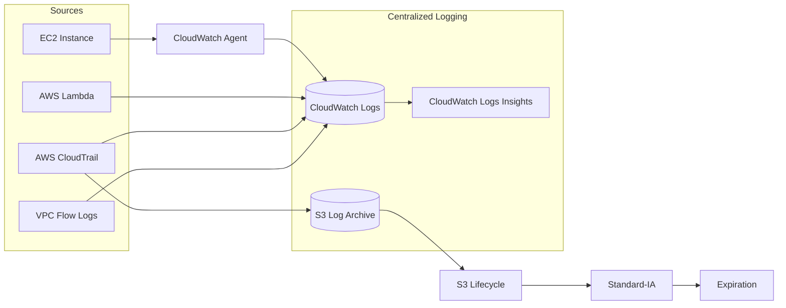

# AWS Centralized Logging with Terraform

A hands-on AWS project demonstrating how logs from multiple AWS workloads and infrastructure services can be collected, centralized, queried, and archived.

The infrastructure is provisioned using Terraform and demonstrates centralized logging for EC2, Lambda, CloudTrail, and VPC network traffic.

## Architecture



## Logging Sources

**EC2 application and system logs**

An Amazon Linux EC2 instance runs the CloudWatch Agent. The agent collects system and sample application logs and forwards them to dedicated CloudWatch log groups.

**AWS Lambda**

Lambda writes application logs natively to CloudWatch Logs using its execution role.

**AWS CloudTrail**

CloudTrail records AWS API activity and delivers audit events to CloudWatch Logs for investigation and to Amazon S3 for archival.

**VPC Flow Logs**

VPC Flow Logs capture network-flow metadata and send accepted and rejected traffic records to CloudWatch Logs.

## Log Storage and Analysis

CloudWatch Logs provides centralized short-term storage and querying. Log groups in this lab use a 7-day retention period.

CloudWatch Logs Insights can be used to investigate application errors, AWS API activity, and network traffic.

CloudTrail also delivers its audit logs to an encrypted S3 archive.

The S3 lifecycle policy moves archived logs to Standard-IA after 30 days and expires them after 90 days.

## Example Queries

Example CloudWatch Logs Insights queries are available in the `queries/` directory:

- `ec2-errors.txt`
- `cloudtrail-security.txt`
- `vpc-rejected-traffic.txt`

For example:

```text
fields @timestamp, @message
| filter @message like /ERROR/
| sort @timestamp desc
| limit 50
```

## Infrastructure as Code

Terraform provisions the infrastructure including:

- CloudWatch log groups
- EC2 instance and CloudWatch Agent IAM role
- Lambda function and execution role
- CloudTrail and its CloudWatch integration
- S3 centralized log archive
- S3 encryption, public-access blocking, and lifecycle management
- VPC Flow Logs
- IAM roles and policies

## Security

The project demonstrates several logging and security practices:

- temporary AWS authentication through IAM Identity Center / SSO
- no long-lived AWS access keys stored in Terraform
- S3 public access blocked
- server-side encryption for archived logs
- IAM service roles for log delivery
- CloudTrail API auditing
- VPC accepted and rejected traffic visibility
- Terraform state and local variable files excluded from Git

## Repository Structure

```text
aws-centralized-logging/
├── configs/
│   └── cloudwatch-agent.json
├── diagrams/
│   └── architecture.md
├── queries/
│   ├── cloudtrail-security.txt
│   ├── ec2-errors.txt
│   └── vpc-rejected-traffic.txt
├── terraform/
│   ├── lambda/
│   │   └── index.py
│   ├── scripts/
│   │   └── ec2-bootstrap.sh
│   ├── cloudtrail.tf
│   ├── ec2.tf
│   ├── iam.tf
│   ├── lambda.tf
│   ├── main.tf
│   ├── outputs.tf
│   ├── providers.tf
│   ├── s3.tf
│   ├── variables.tf
│   ├── versions.tf
│   └── vpc-flow-logs.tf
├── .gitignore
└── README.md
```

## Deployment

Authenticate to AWS using IAM Identity Center:

```bash
aws sso login --profile my-aws
```

Initialize Terraform:

```bash
cd terraform
terraform init
```

Validate the configuration:

```bash
terraform fmt -check -recursive
terraform validate
```

Review the deployment plan:

```bash
AWS_PROFILE=my-aws terraform plan
```

Deploy:

```bash
AWS_PROFILE=my-aws terraform apply
```

After testing, remove the lab infrastructure:

```bash
AWS_PROFILE=my-aws terraform destroy
```

## Production Improvements

This project intentionally uses a simplified single-account architecture for hands-on learning.

A production implementation could extend the architecture with:

- a dedicated centralized logging/security AWS account
- AWS Organizations and organization-wide CloudTrail
- cross-account log aggregation
- customer-managed AWS KMS keys
- stricter least-privilege IAM policies
- longer retention based on compliance requirements
- Amazon OpenSearch or a SIEM platform for advanced security analytics
- alerting and automated incident-response workflows

## Purpose

The project was built to practice the operational side of AWS logging: collecting logs from different sources, centralizing visibility, managing retention, querying events during troubleshooting, and designing a path toward a multi-account production logging architecture.
