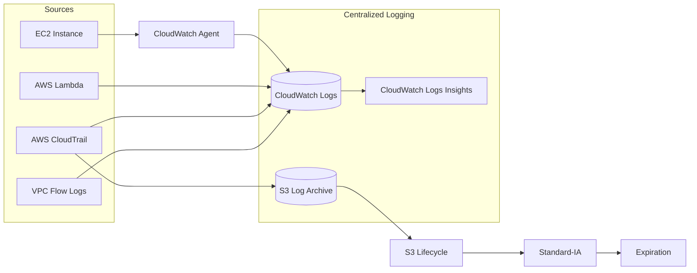

# AWS Centralized Logging Architecture

```mermaid
flowchart LR

    EC2[EC2 Instance]
    Lambda[AWS Lambda]
    CT[AWS CloudTrail]
    VPC[VPC Flow Logs]

    Agent[CloudWatch Agent]
    CW[(CloudWatch Logs)]
    S3[(S3 Log Archive)]
    Insights[CloudWatch Logs Insights]

    EC2 --> Agent
    Agent --> CW

    Lambda --> CW

    CT --> CW
    CT --> S3

    VPC --> CW

    CW --> Insights

    S3 --> Lifecycle[S3 Lifecycle]
    Lifecycle --> IA[Standard-IA]
    IA --> Delete[Expiration]

    subgraph Sources
        EC2
        Lambda
        CT
        VPC
    end

    subgraph Centralized Logging
        CW
        Insights
        S3
    end
```    
